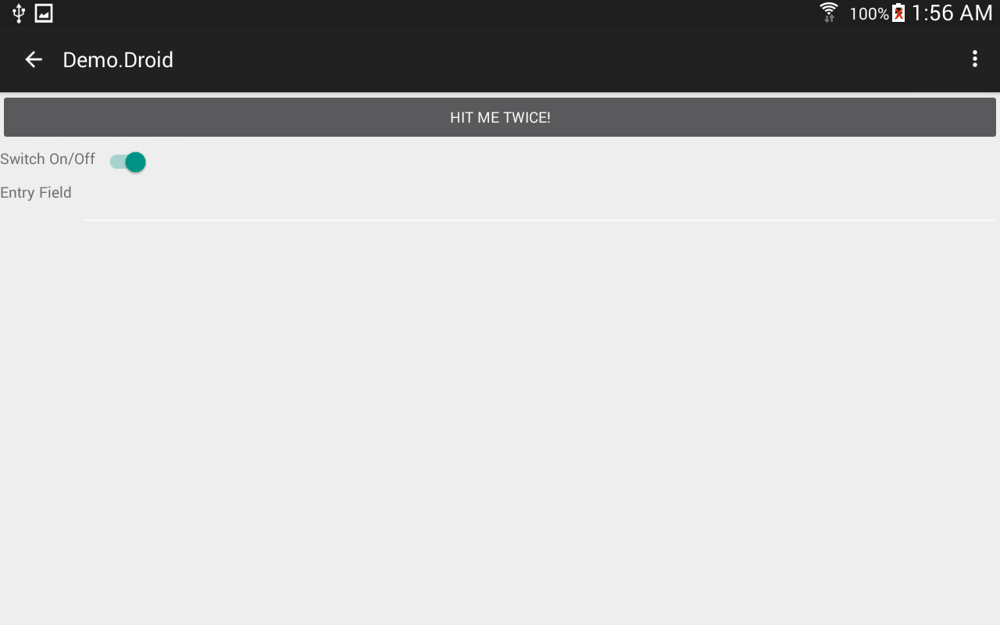

# xamarin
Provides various libraries for making Xamarin.Forms development easier. Check out the [wiki](https://github.com/mikepham/xamarin/wiki) for more information.


## [AppCompat](https://www.nuget.org/packages/NativeCode.Mobile.AppCompat/)
Simply install the NuGet package into your Android project.

`Install-Package NativeCode.Mobile.AppCompat`

Once installed, you should replace your *FormsApplicationActivity* derived activities with *AppCompatFormsApplicationActivity*.

For instance:

```csharp
public class MainActivity : AppCompatFormsApplicationActivity
{
  protected override void OnCreate(Bundle savedInstanceState)
  {
    base.OnCreate(savedInstanceState);

    Forms.Init(this, savedInstanceState);

    this.LoadApplication(new App());
  }
}
```

You can then use the normal `Forms.Init` and `LoadApplication` methods to initialize your activities.

## [AppCompat Controls](https://www.nuget.org/packages/NativeCode.Mobile.AppCompat.Controls/)
Simply install the NuGet package into your PCL project that contains your UI.
NOTE: You must install the Renderers package into your Android project.

`Install-Package NativeCode.Mobile.AppCompat.Controls`

### Available controls
- FloatingButton ([FloatingActionButton](https://developer.android.com/reference/android/support/design/widget/FloatingActionButton.html))
- IUserNotifier ([Snackbar](https://developer.android.com/reference/android/support/design/widget/Snackbar.html))

## [AppCompat Renderers](https://www.nuget.org/packages/NativeCode.Mobile.AppCompat.Renderers/)
Simply install the NuGet package into your Android project.

`Install-Package NativeCode.Mobile.AppCompat.Renderers`

Once installed, you will have to call `AppCompatRenderers.EnableAll` inside your OnCreate, after `Forms.Init` is called. This will register all of the AppCompat renderers to replace existing Xamarin.Forms renderers.

### Current Renderers
- Button ([AppCompatButton](http://developer.android.com/reference/android/support/v7/widget/AppCompatButton.html))
- Entry ([AppCompatEditText](http://developer.android.com/reference/android/support/v7/widget/AppCompatEditText.html))
- Switch ([SwitchCompat](http://developer.android.com/reference/android/support/v7/widget/SwitchCompat.html))
- MasterDetailPage

## Devices Tested

### Phones
- Nexus 5 (emulator)
- Samsung Galaxy S6

### Tablets
- Samsung Tab 7
- Nexus 7

## Screenshots




<iframe class="tscplayer_inline embeddedObject" name="tsc_player" scrolling="no" frameborder="0" type="text/html" style="overflow:hidden;" src="http://www.screencast.com/users/reginfo7665/folders/Snagit/media/a5926a88-0862-4046-be88-a664132c06e7/embed" height="682" width="384" webkitallowfullscreen mozallowfullscreen allowfullscreen></iframe>
